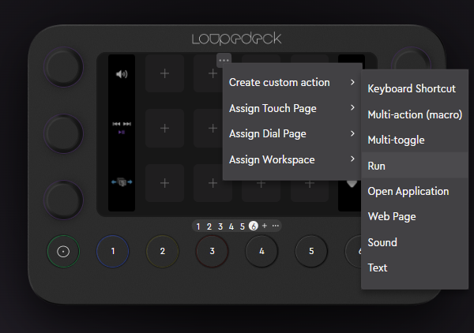
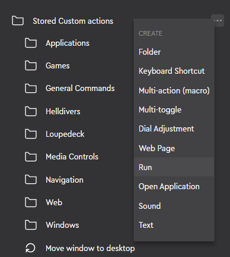
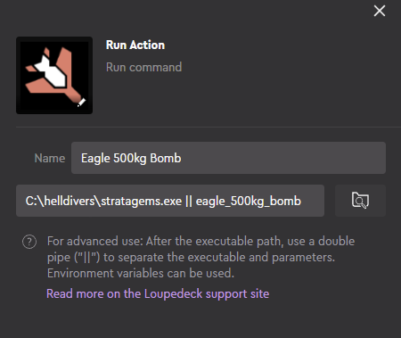

## Important Note

For some reason, windows defender might falsy detect this as a Wacatac Trojan.
Add the directory containing the files you downloaded, to remedy this issue, as defender might delete the files.

If you don't feel comfortable with the provided binaries, you can take a look at the code and compile it yourself. (instructions on how to compile below)

## Description

This is a simple macro execution script used to quickly execute strategem actions in Helldivers 2.
This was mainly created with the loupedeck in mind, but it can also be used by other macro software and hardware, in the same fashion.

## Setup

Download the necessary files from the releases section and extract them ina directory of your choice.<br>
A recommended option is C:\helldivers because it will make it easier for setting up loupedeck actions.

## Configuration

You can modify the sequence keys to any key that you desire.
> Meaning you can for example bind the [Up, Down, Left, Right, stratagem_open] keys to any other key, like WASD and Alt, depending on what you use in-game.

To modify the key bindings, simply run the  configuration.exe file and follow the prompts.

## LoupeDeck setup

In loupedeck, create a new "Run command" action.

- Directly on the tile

  

Or

- From the sidebar

  


Select the stratagems.exe file and add key corresponding to the stratagem you want to trigger, as a parameter.<br>
**keys for the stratagems can be referenced in the codes.json file**



**! For non-loupedeck users !**<br>
When using this script with something other than the loupedeck, make sure to omit the double pipe **||** when adding the parameter.

## Icons

To get all icons for the stratagem actions, you can either:
- Download the [Streamdeck Helldivers 2 Stratagem plugin](https://marketplace.elgato.com/product/helldivers-2-stratagem-0c648333-25a0-403f-9894-22c5f6b1ff89), which provides all icons in the zip,
- Get the SVGs from **@nvigneux 's** [Helldivers-2-Stratagems-icons-svg](https://github.com/nvigneux/Helldivers-2-Stratagems-icons-svg?tab=readme-ov-file) repository

## Compiling (optional)

If you want to compile the executables yourself, you need to have python 3.12 installed, along with the project's dependencied.
You can install the dependencies by executing ``` pip install -r requirements.txt ```

After you installed the dependencies, run the compile.py script with ``` python ./compile.py ``` to compile the binaries.

**Now go spread some democracy, soldier!**
